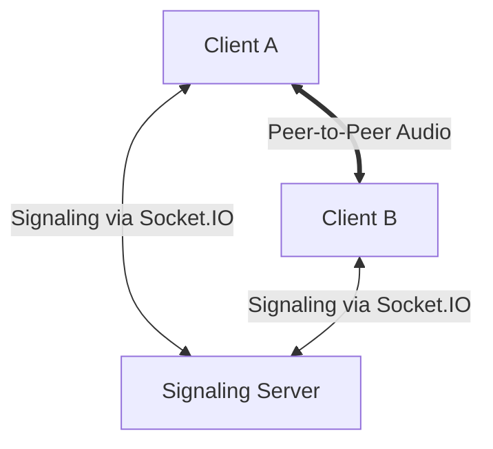

# Project Architecture 🏗️

Dev Walkie-Talkie follows a decentralized media architecture with a centralized signaling layer.

## Overview
The system consists of three main parts:
1. **Signaling Server (Backend)**: Matchmaker for peers.
2. **Frontend App (PWA)**: UI and WebRTC logic.
3. **STUN/TURN Infrastructure**: NAT traversal.

## High-Level Diagram

## Key Components

### Signaling Server
Built with Node.js and Socket.IO. It maintains ephemeral state about active rooms and the peers within them. When a peer joins, it broadcasts their presence, triggering the WebRTC handshake.

### WebRTC Service
Located in `frontend/src/services/webrtcService.js`. It wraps the native `RTCPeerConnection` API. It handles:
- Audio track management.
- ICE candidate gathering.
- SDP generation (Offer/Answer).

### PWA Layer
Enabled by a custom Service Worker and Manifest. It allows the app to be "installed" on mobile home screens, providing a full-screen, low-latency communication experience.
